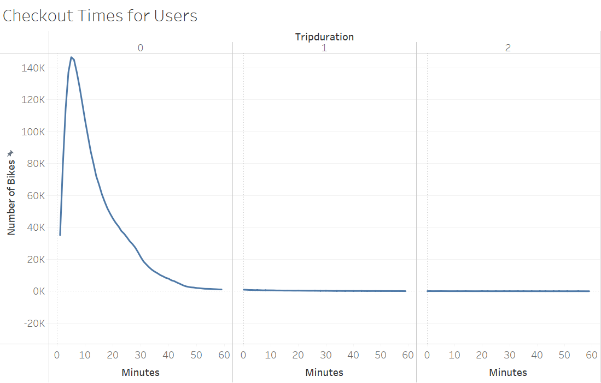

# NYC Citi Bike Bike-sharing Program
## Purpose:
For this project, I will use data from the Citi Bike program in New York City to help Kate in her Des Monies new bike-sharing program business proposal.

## Overview of the statistical analysis:
In this project I will be conducting bike trip analysis using Tableau to reveal underlying patterns and trends in the NYC Citi Bike data.

## Results
1. NYC Citi Bike Overview

As shown in the above dashboard, the relationship between average trip duration and birth year does not hold a specific pattern over the extended timeline. However, it shows significant increase over the last 10 years. Building on this trend, it is expected to keep increasing for upcoming years. From gender perspective, male riders has the largest share among bikes users.

2. Bike Utilization

The bubble chart above represents the utilization of each bike. The circle size is the sum of trip duration for each bike. The results show wide range of utilization which makes it difficult to use this data for this particular project.

3. Checkout Times for Users

As shown above, the majority of users check out after 25 minutes of trip duration with a peak at 5 minutes trip duration.

4. Checkout Times by Gender

In general, females ride bikes for longer trip duration but in lower frequency.

5. Trips by Weekday per Hour

The rush hours for Citi Bike during weekdays are 5 and 6 pm on Thursday with highest number of shared citibikes (43,982 and 44,905 respectively).

6. Trips by Gender

.png)

Overall trips per gender shows the same pattern of as trips weekdays per hour. However, slicing through the data for *females* only show that bikes are at high demand on Saturday and Sunday! with peak hour on Saturday 12 pm.

7. User trips Gender Weekday Distribution

The heatmap above shows that male subscribers have the highest number of citi bike rides all week and mostly on Thursday.

From more details about any of the above charts and more please visit the project's tableau public page:

[Link to challenge Dashboard](https://public.tableau.com/app/profile/wisam3589/viz/NYCitiBikeVisualization/UserTripsbyGenderbyWeekday)

[Link to module Dashboard](https://public.tableau.com/app/profile/wisam3589/viz/NYCityBikes_16324033703560/NYCStory)

## Summary:
The results show potential success for bike-sharing project. Number of expected rides is high and utilization is proposed to be sufficient to keep the bikes spinning! Additional  visualizations may give clearer view about the data. Here are my recommendations:

* Bike utilization per areas: this helps with optimizing bike distribution and investigating relations to other factors such as attractions in the area.
* Bike repairs in terms of total trip duration per bike: this helps in assessing maintenance cost.

