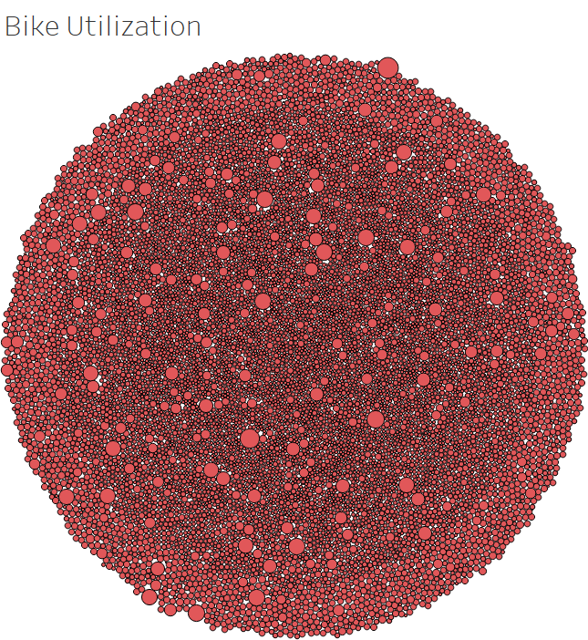

# bikesharing
## Purpose:
For this project, I will use data from the Citi Bike program in New York City to help Kate in her Des Monies new bike-sharing program business proposal.

## Overview of the statistical analysis:
In this project I will be conducting bike trip analysis using Tableau to reveal underlying patterns and trends in the NYC Citi Bike data.

## Results
1. NYC Citi Bike Overview

As shown in the above dashboard, the relationship between avegrae trip duration and birth year does not hold a specific pattern over the extended timeline. However, it shows significant increase over the last 10 years. Building on this trend, it is expected to keep increasing for upcoming years. From gender perspective, males riders has the largest share among bikes users.

2. Bike Utilization

